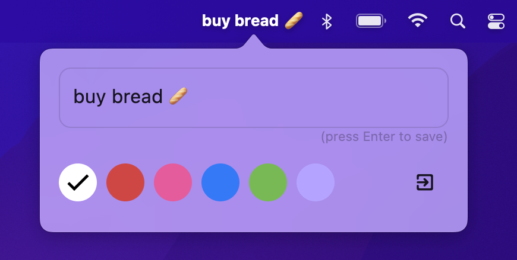

<h1>Last thing</h1>

<b>One task in your menu bar</b>

 
 

A useful tool for to help you focus on a single task.

## Download

- [Last thing](https://github.com/davideagostini/last_thing/tree/main/installers/dmg_creator/last_thing.dmg)

Requires macOS 12 or later.

## Features

- Show in your menu bar
- Assign a color to the task
- Quick action to close app

 ## Screenshots

 
 

 ## Built with

 This a funny app built with Flutter. 
 
 It draws inspiration from [One Thing](https://sindresorhus.com/one-thing) by Sindre Sorhus. 

